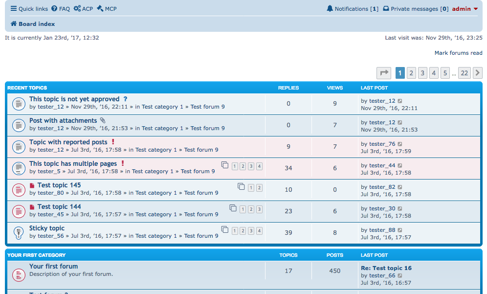

Recent Topics for phpBB 3.2 / 3.3
==========

Extension for phpBB to display recent topics.
Based on NV Recent Topics for phpBB 3.0, by Joas Schilling ([nickvergessen](https://github.com/nickvergessen))

#### Version
v2.2.15 (05/04/2021) 

    
#### Support
- [Support forum](https://www.avathar.be/forum/viewforum.php?f=65)

#### Requirements
- phpBB 3.2.0 or higher

#### Features
- Adds a list of recent (or unread) topics or last reply to topics to the index page.
- UCP permissions and settings so users can choose their own preferences to override ACP.
- can view all recent topics on a special page /app.php/rt (as of 2.2.7)
- ACP / UCP Options:
  - Screen location : Top, bottom or Right.
  - number of topics to show per page  (as of 2.2.7)
  - sort by topic start time, instead of last post time
  - only show unread topics
- ACP Options  
  - Show all recent topic pages
  - max. number of pages
  - set minimum topic type level to display (normal/sticky/announcement/global)
  - exclusion of topics (by ID)
  - display parent forum name in the row
- Inherits all styling from regular "viewforum" templates
- filters "re: from replies" (as of 2.2.11)
- compatible with 
   - "Pre:fixed" Extension from imkingdavid 
   - “Topic Prefix“ Extension from Stathis.
   - official extension "phpbb/topicprefixes"
   - Mchat 2.0.1 (as of 2.2.3)  
   - Collapsible Categories v2 (as of v2.2.9)
- Tested on:
  - prosilver  
  - we_clearblue (only non-cdb verion), 
  - proflat 
  - pbWow3
  - ComBoot (as of 2.2.7, only non-cdb verion)

#### Languages supported
- English, German, French, Dutch, Spanish, Czech, Russian, Portuguese, Arabic, Czech
  
### Installation
1. [Download the latest release](https://www.avathar.be/forum/app.php/dlext/details?df_id=35) and unzip it.
    - cdb build = built for phpBB CDB
    - standard build = has extra features, support for styles not in Cdb.
2. Copy the entire contents from the unzipped folder to `/ext/paybas/recenttopics/`.
3. Navigate in the ACP to `Customise -> Manage extensions`.
4. Find `Recent Topics` under "Disabled Extensions" and click `Enable`.

#### Uninstallation
1. Navigate in the ACP to `Customise -> Manage extensions`.
2. Click the `Disable` link for `Recent Topics`.
3. To permanently uninstall, click `Delete Data`, then delete the `recenttopics` folder from `/ext/paybas/`.

### License
[GNU General Public License v2](http://opensource.org/licenses/GPL-2.0)

© 2015 - PayBas
© 2017 - Sajaki

